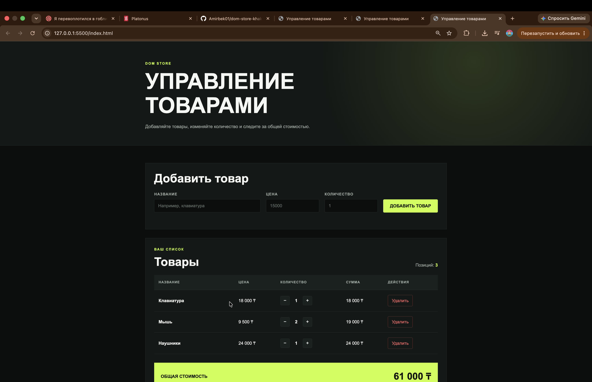

# DOM Store

An interactive product management page created with HTML, CSS and pure JavaScript.

## Features

- rendering products from the `Store` class;
- adding products through a form;
- validation errors displayed next to the form fields;
- increasing and decreasing product quantity;
- deleting products;
- automatic total price calculation;
- event delegation for product action buttons;
- responsive layout.

## How to Open

Open `index.html` in a browser.

For easier development, open the project in VS Code, install the Live Server extension and select **Open with Live Server**.

No npm packages or frameworks are required.

## Events

I used the `submit` event to process the product form without reloading the page. The form values are checked before a product is added, and validation errors are displayed in the DOM next to the corresponding fields. I used one `click` event listener on the product list to handle delete, increase and decrease buttons through event delegation. After every action, the product list and total price are rendered again so that the page always displays the current Store data.

## Screenshot

## AI Tools

I used ChatGPT to clarify the assignment requirements, review the project structure and check the JavaScript logic. I read the suggested code, tested its behavior and adapted it for my project.

## Author

Khakimzhan Amirbek